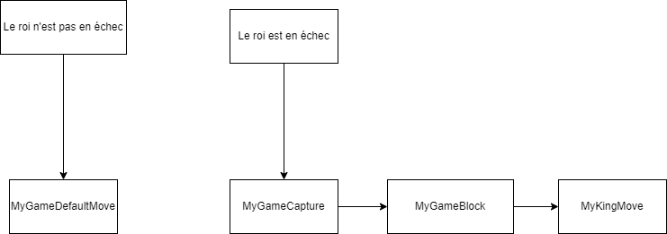

# Myg Chess Game

This is a chess game for Pharo based on Bloc, Toplo and Myg.

## What is this repository really about

The goal of this repository is not to be a complete full blown game, but a good enough implementation to practice software engineering skills:
 - testing
 - reading existing code
 - refactorings
 - profiling
 - debugging

## Getting started

### Getting the code

This code has been tested in Pharo 12. You can get it by installing the following baseline code:

```smalltalk
Metacello new
	repository: 'github://kbsb0/Chess:main';
	baseline: 'MygChess';
	onConflictUseLoaded;
	load.
```

### Using it

You can open the chess game using the following expression:

```smalltalk
board := MyChessGame freshGame.
board size: 800@600.
space := BlSpace new.
space root addChild: board.
space pulse.
space resizable: true.
space show.
```

## Explain the basics

1. **what katas you did ?**

	Nous avons choisi de faire les katas : 

 * Fix pawn moves!	
 * Restrict legal moves
 * Add pawn promotion

2. **what difficulties you encountered and how you solved them ?**

	Nous avons rencontré plusieurs difficultés :   
	* *Langage pharo* :   
		Le projet a été réalisé en pharo qui est un nouveau langage pour nous.   
		Même si son fonctionnement est similaire au langage orienté objet que nous connaissons déjà ( comme java ), sa syntaxe particulière n’a pas été facile à prendre en main.  
		Nous avons donc dû dans un premier temps nous documenter sur ce langage, et faire des exercices pour nous familiariser avec.

	* *Compréhension du code fourni* :  
	Pour réaliser nos katas, nous disposions d'une base de code préexistante.  
	Étant donné que nous n’avions pas écrit ce code, nous avons dû consacrer du temps à analyser son fonctionnement, à comprendre l’utilité de chaque classe, fonction, etc.   
	Pour mieux comprendre le code, nous avons utilisé les principes vus en cours, notamment le Reverse Engineering.  
	C'est-à-dire, en regardant une partie du code (celle qui nous intéressait sur les pièces et le jeu),  puis aussi en regardant les tests pour savoir ce que faisait le code.

	* *Jeu d’échecs* :  
	Nous avons passé du temps à comprendre nos katas ( quels étaient les objectifs ).  
	Ne connaissant pas entièrement bien le jeu des échecs, nous avons dû aussi nous documenter ( pour la prise en passant notamment ).


	* *Kata* :  
	La réalisation des katas a généré plusieurs difficultés : 
		* **La prise en passant:**  
	La prise en passant est une règle particulière que les pions peuvent utiliser uniquement dans certaines situations spécifiques. Au départ de la partie, le mouvement des pions n’était pas adapté à cette règle. La première difficulté a été de corriger les mouvements afin qu’ils puissent avancer d'une case, et exceptionnellement de deux cases s’ils n’avaient jamais bougé. De plus, les pions ne peuvent attaquer qu’en diagonale. Il a fallu comprendre quelles méthodes intervenaient dans les mouvements des pions et identifier les éléments impactant la partie graphique.

			Ensuite, nous avons abordé la prise en passant. L’une des difficultés majeures a été de déterminer comment détecter la situation dans laquelle un pion peut effectuer cette prise. Il était nécessaire de connaître les cases concernées, leur contenu (allié ou ennemi ?) et leur état (le pion a-t-il avancé d’une ou deux cases ?). Cette tâche a été complexe et a pris du temps. De plus, certains cas particuliers n’avaient pas été pris en compte, comme le fait qu’un pion ne peut pas sauter par-dessus une autre pièce s’il se trouve sur sa case de départ, ou encore le fait que la prise en passant ne peut plus être effectuée si elle n’a pas été réalisée immédiatement après le mouvement du pion adverse.

			Enfin, les dernières difficultés rencontrées concernaient l’écriture d’un code « propre ». Après avoir écrit un code fonctionnel, il était nécessaire de le refactoriser en raison de duplications. Par exemple, la gestion des couleurs des pions était souvent réalisée à l’aide de conditions telles que ```piece isWhite ifTrue:[] ifFalse:[]```. De plus, le code était difficile à maintenir, car plusieurs conditions dépendaient du contexte spécifique du jeu. Par exemple, l’état d’un pion était directement lié à sa position sur le plateau (ligne 5), ce qui poserait problème dans un jeu personnalisé où ce comportement pourrait ne plus être valide. Le code était donc à la fois peu clair et peu maintenable.

			Pour résoudre ces problèmes, nous avons exploré différentes solutions et cherché quel design pattern pourrait être utilisé pour améliorer la lisibilité et la maintenabilité du code. Cela nous a permis d’adopter des solutions plus flexibles et de limiter les dépendances au contexte du jeu.


		* **Logiques d’échec**:  
		ll existe plusieurs façons de contrer un échec: 
			1. Soit une pièce peut capturer la pièce menaçante 
			2. Soit une pièce peut bloquer la pièce menaçante 
			3. Soit le roi échappe à la menace en se déplaçant.  

			Pour pouvoir prendre en compte tous les cas il a fallu décomposer le code qui
			permet de déplacer une pièce pour prendre en compte l’échec du roi et quoi
			faire alors dans ce cas.  
			Mais il a fallu aussi conserver la logique actuelle lorsqu’il n’y a pas d’échec.

		* **Promotion des pions** :  
		La principale difficulté de ce kata résidait dans la compréhension des objets utilisés pour l'affichage.  
		Nous avons d'abord commencé par comprendre et réaliser des exercices simples d'affichage (par exemple, afficher un bouton, générer un comportement lors d'un clic, etc.).  
		Pour approfondir nos connaissances, nous avons cherché où les classes liées à l'affichage étaient utilisées et avons trouvé des tests existants dans Pharo qui montraient des exemples d'utilisation.  
		Ces tests nous ont permis de comprendre comment créer une fenêtre et ajouter les éléments souhaités.
		
	

	La deuxième difficulté a été de différencier les cas où le joueur effectue le mouvement du pion manuellement et ceux où le mouvement est effectué automatiquement.  
		Il a été compliqué de cerner quelles fonctions étaient appelées uniquement dans le cas du mouvement automatique.  
		Cependant, grâce au travail préalable sur la compréhension de l'affichage graphique, nous avons pu résoudre ce problème assez facilement.


	* *Merge:* 
	
		Le merge à la fin qui a été dangereux puisque même si nous n'avons pas touché à du code en commun, il y a eu quelques problèmes dans notre jeu qui nous a donné du fil à retordre.   
		Cependant, il s'agissait de petits problèmes d'incohérence qui ont été réglés en reprenant le code présent sur nos branches respectives. 

3. **how well is your code tested and how did you do it. Automated testing, mutation testing, manual testing ?**

	* **Test manuel** :  
		Tout d'abord, nous avons effectué des tests manuels.  
		En effet, comme nous disposons d'une interface graphique, il était relativement simple et rapide de vérifier que la fonctionnalité ajoutée semblait fonctionner correctement.
	* **Tests unitaires** :  
		Par ailleurs, nous avons ajouté plusieurs classes de tests unitaires pour nous assurer du bon fonctionnement de nos méthodes.  
		Ces tests ont été écrits de manière à couvrir différents scénarios et comportements du code.
	* **Test coverage** :   
		Nous avons utilisé les outils abordés en cours pour mesurer la couverture de notre code, qui est actuellement d'environ 50 %.   
		Le score n'est pas élevé, mais il est en partie justifier par le fait que nous avons beaucoup de getter et de setter, que nous avons fait le choix de ne pas tester.
	* **Tests de mutation** :  
		Enfin, nous avons utilisé des tests de mutation pour vérifier l'efficacité de nos tests en termes de détection de bugs.  
		Ces tests consistent à introduire des erreurs dans le code et à vérifier si nos tests sont capables de les détecter.  
		En moyenne, nous obtenons un mutation score de 70 %, ce qui indique que nos tests détectent un bon nombre de mutations.

	Remarque: les tests sont localisés dans le package `Myg-Chess-Tests`.

## Relevant Design Points

1. **Why is the code like this?**

	Nous avons repris en grande partie le code déjà réalisé.  
	Nous avons remarqué plusieurs problèmes dans le code qui existait déjà: 
	* le mouvement des pions mal réalisé
	* les mouvements en cas d’échec
	* les mouvements de la tour
	
	C’est pour cette raison que nous avons choisi ces katas.


	Dans le projet de base, plusieurs éléments nécessitaient des corrections, notamment les mouvements des pièces. Pour faciliter notre travail, nous avons isolé les parties du code directement liées à notre kata. Nous avons ainsi corrigé, par exemple, les mouvements des pions, qui interviennent dans la prise en passant et la promotion. En revanche, nous n'avons pas modifié les mouvements de la tour ou de la dame.

	De plus, nous avons cherché à refactoriser notre code du mieux possible, en utilisant des design patterns, par exemple. Cependant, il se peut que certains choix n'ont pas été généralisés à d’autres parties du code afin de ne pas "tout casser".


	***Ce qui a été corrigé:***
    - **La prise en passant**: les mouvements de base des pions, l'attaque en diagonale, ainsi que la prise en passant lorsqu'elle se présente.

    - **La promotion**: lorsqu’un pion atteint la dernière ligne, il peut être promu. Une fenêtre s'ouvre pour permettre de choisir la nouvelle pièce. Nous avons géré le cas où, si l'utilisateur ferme la fenêtre sans faire de choix, un choix par défaut est effectué (le pion se transforme en dame). De même, si le pion est promu suite à un mouvement automatique, le choix est également fait par défaut.

    - **Gestion du tour par tour** : nous avons ajouté une gestion du tour de jeu. Ainsi, au démarrage de la partie, ce sont les pièces blanches qui peuvent être déplacées. Il n'est plus possible de déplacer une pièce d'une couleur si ce n'est pas son tour.

	


2. **Why is this part of the code more tested than the other?**

	Nous avons choisi de tester les parties du code qui intervenaient dans nos katas. C'est pourquoi, vous trouverez par exemple plusieurs tests qui concerne le mouvement des pions, mais très peu sur celui des dames ou des tours.

3. **Where did you put the priorities?**

	Nous avons choisi d’avoir en priorité quelque chose de fonctionnel. Nous souhaitions que les tâches demandées par nos kata soient réalisées correctement et que tout fonctionne comme prévu. Par la suite, nous avons effectué un refactoring pour rendre le code plus lisible, clair et agréable.


4. **Where did you use (or not) design patterns in the code and why?**

	Nous avons choisi d'utiliser les design pattern :

* **State** :  

	**MyPieceState:**
	Pour pouvoir gérer au mieux les cas de prise en passant, il était nécessaire de marquer les pions d'un état. On a donc le schéma suivant pour la gestion des états : 

	

	Ainsi, si le pion n'a pas encore bougé il est dans l'état `inital`, s'il avance de deux cases il passe dans l'état `double avancée`. Enfin, pour tout autre mouvement il sera dans l'état `en mouvement`.
	Mettre en place le pattern state a permis de simplifier grandement le code, en délégant l'évolution de l'état directement à l'objet state en question. De plus, si dans une possible évolution, les pions ( ou d'autres pieces ) peuvent être dans un nouvel état, on ne devra qu'ajouter une nouvelle classe. 
	Ce choix de modélisation nous permet de prévenir facilement certaine évolution. 
	Remarque : ce design pattern a été combiné avec un visitor ( voir plus bas ).


* **Strategy:** 

	*MyPieceMoveStrategy:*
	Les pions noirs et blancs diffèrent par leur sens de déplacement, l'un allant vers le haut et l'autre vers le bas. Pour simplifier la gestion de leurs mouvements, nous avons utilisé le pattern Strategy. Ce modèle permet, par le biais d'une méthode, de déterminer facilement la case située juste devant le pion. De plus, étant donné que le sens de déplacement du pion ne dépend plus de sa couleur mais de la stratégie qu'il utilise, il serait facile de modifier son déplacement dans un jeu évolué, simplement en changeant la stratégie.

	*MyChessColor:*
	Lors de la promotion du pion, on doit pouvoir transformer le pion en une pièce de la même couleur que celui-ci. Pour se faire, le joueur a normalement le choix parmis 4 pièces : fou, tour, cavalier ou dame.

	

	La première evrsion de notre code présentait trop de répétitions. La seule différence entre les pièces à créer était leur couleur. Nous avons donc ajouté la classe *MyChessColor* , qui représente la stratégie associé à la couleur de la pièce. Cet objet possède un message `createPiece:` qui, lorsqu'on lui passe la classe d'une pièce, renvoie une instance de cette pièce avec le type correspondant et la même couleur que celle définie par la stratégie.

	Ainsi, si on a par exemple un pion noir, dont la stratégy est une instance de la classe `MyChessColorBlack`, le message ```pawn pieceColor createPiece: MyQueen``` renverra un objet `MyQueen` de la couleur noir.

    	Ce pattern nous a permis de savoir, pour une case donné, si la case au dessus ou la case en dessous était occupé ou non. Celà nous a servi pour pouvoir faire la prise en passant car nous pouvions faire si la case derrière était encore libre. 
  


* **Chain of responsibility** (pour le kata Restrict legal moves)

	Ce pattern nous a permis d'appliquer un ordre dans l'exécution du kata.  

	En effet, grâce à ce pattern, lorsque le roi est en échec, le jeu décide d'appliquer la logique de capturer une pièce,   
	puis si ce n'est pas possible, il applique la logique de bloquer la pièce menaçante avec une pièce du joueur qui peut jouer.  
	Sinon c'est le roi qui doit se déplacer en dernier recours.  
	Enfin il y a aussi un état par défaut qui conserve la logique qui était déjà existante lorsqu'il n'y a pas d'échec : une pièce aléatoire du joueur qui doit jouer se déplace. 

	L'avantage de ce design pattern dans ce cas est que le code est ainsi décomposé dans plusieurs classes (une pour chaque logique).  
	Il est donc plus facile d'ajouter une nouvelle logique pour contrer l'échec et ces logiques ne sont pas regroupées dans une seule méthode qui serait beaucoup moins lisible. 

	

* **Visitor**(pour le kata Fix pawn moves!)

	Pour mettre en place `la prise en passant`, il était nécessaire de connaitre les pièces qui entourent le pion. On devait pouvoir savoir si un pion adverse venait de faire un déplacement de deux cases. Le design pattern Visitor a permis de pouvoir adopter le bon comportement en fonction de l'état des pions adverses.

	Remarques : 
	Voici un exemple de comment on procède pour savoir si une prise en passant est possible : 

	


	Le pion noir qui se trouve dans la case h5 vient d'avancer de deux cases. 
	Pour déterminer si le pion blanc peut faire la prise en passant, on visite le pion noir qui est à sa droite et on regarde son état. Le but du visitor est de déterminer si la case h6 est une case à cibler ou non. De plus, on précise la stratégie d'attaque qui veut être utilisée ( représenté dans le code par la chaine `'moveEnPassant'` ). Comme l'état du pion en h5 correspond à celui d'une `double avancée`, la case h6 est bien un mouvement possible pour le pion blanc.

	Nous avons choisi d'utiliser des chaînes de caractères pour spécifier la stratégie dans les fonctions du Visitor, car cela simplifie le code et le rend plus direct. Néanmoins, il pourrait être plus pertinent d'utiliser le design pattern Strategy pour améliorer la flexibilité et la maintenabilité de notre code.

	
